# 2. Общие сведения

Данный раздел руководства содержит:
- [Информацию о входе в систему](#21-вход-в-систему);
- [Описание пользовательского интерфейса](#22-пользовательский-интерфейс);
- [Работу с диалоговыми окнами](#23-диалоговые-окна);
- [Работу с таблицами](#24-работа-с-таблицами);
- [Добавление записей в систему](#25-создание-записей).

 

## 2.1 Вход в систему
 

Вход в систему осуществляется путем ввода данных логина и пароля. После нажатия кнопки **[Вход]** открывается начальная страница.

 

## 2.2 Пользовательский интерфейс
 

**АСР Platex®** имеет удобный пользовательский веб-интерфейс для работы администраторов, операторов и других пользователей системы. 

Отображение элементов системы может отличаться в зависимости от роли пользователя. 

 

## 2.3 Диалоговые окна
 

***Диалоговое окно*** — это временное окно, создаваемое приложением (сайтом) для получения вводимых пользователем данных. Приложение (сайт) обычно использует диалоговые окна, чтобы запросить у пользователя дополнительные сведения о пунктах меню. Диалоговое окно обычно содержит один или несколько элементов управления (дочерних окон), с которыми пользователь вводит текст, выбирает параметры или направляет действие.

 

>**Примечание**  
>Это определение процитировано из справочной системы [Windows](https://learn.microsoft.com/ru-ru/windows/win32/dlgbox/dialog-boxes), в которой также описаны основные сведения о диалоговых окнах, их использование, функции и другие параметры.

 

В веб-интерфейсе **АСР Platex®** используются ***модальные диалоговые окна***.

***Модальным диалоговым окном*** называется окно, которое запрещает доступ к работе с остальной частью приложения.

В диалоговых окнах **АСР Platex®** используются кнопки **[Сохранить]**, **[Отменить]**, **[Добавить]**, **[Применить]**.

**[Сохранить]** - подтверждение согласия на внесенные изменения (если изменений не было, то кнопка **[Отменить]** используется как закрытие диалогового окна);

**[Отменить]** - несогласие с внесенными изменениями (если изменений не было, то кнопка **[Отменить]** используется как закрытие диалогового окна);

 

**[Добавить]** - появление дополнительного диалогового окна для добавления сведений в основное диалоговое окно.

 

**[Применить]** - подтверждение согласия на внесенные изменения (если изменений не было, то кнопка **[Применить]** используется для сохранения внесенных изменений, но при этом диалоговое окно не закрывается).

 

## 2.4 Работа с таблицами

 

***Таблицы*** - это основной способ отображения данных в **АСР Platex®**.

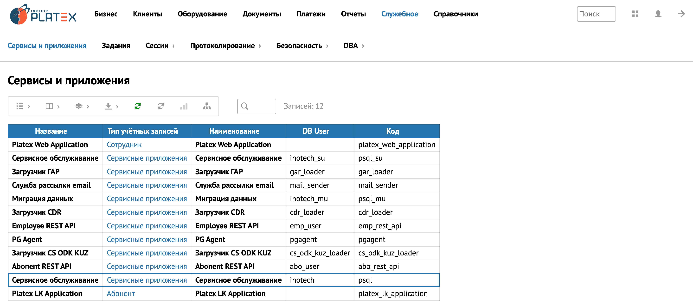

 

В одной части экрана может отображаться несколько таблиц, взаимосвязанных друг с другом. Такой вид отображения таблиц называется ***Master-Detail***.

То есть, одной записи из ***Master-*** источника данных соответствует некоторое количество значений из ***Detail***-источника данных. Другими словами, ***Detail***-данные являются дочерними по отношению к ***Master***-данным.

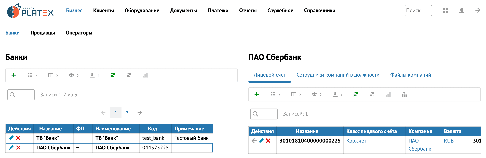

 

Также в рамках одной таблицы между записями может существовать связь, которая образует иерархию.

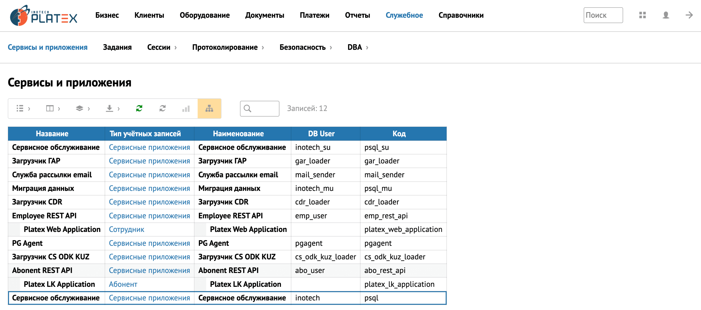

 

### 2.4.1 Панель инструментов
 

Над таблицами располагается панель инструментов для работы с табличными данными.

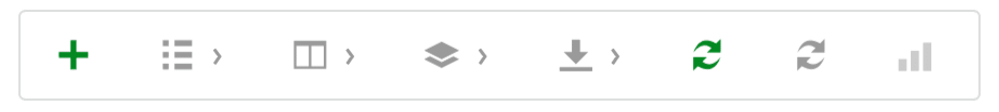

 

Пользователь может совершать действия над табличным представлением, которые не меняют данные **АСР Platex®**, а помогают настроить внешний вид таблицы, быстро найти нужную запись, выгрузить или распечатать таблицу.  Панель инструментов подразумевает собой общие действия для работы над таблицей. Кнопки в панели инструментов могут отличаться в зависимости от действий, которые можно сделать с таблицей.

Ниже приведены описания кнопок из которых может состоять панель инструментов.

 - создание записи;

 - отображение количества записей на странице;

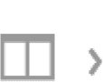 - отображение выбранных столбцов в таблице (для выбора всех столбцов необходимо выбрать «Все»)

 - группировка записей в таблице по столбцам;

 - экспорт в форматы HTML, PDF, CSV, JSON;

 - обновление таблицы;

 - сброс всех примененных фильтров и приведение таблицы к статусу «по умолчанию»;

 - итого/вычисление суммы по рассчитываемому столбцу;

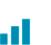 - просмотр диаграмм;

 - отображение иерархии в записях таблицы;

 - отчет по параметрам.

 

### 2.4.2 Работа с записями таблицы
 

Напротив каждой записи, в колонке ***Действия***, располагаются кнопки для работы с данной записью.

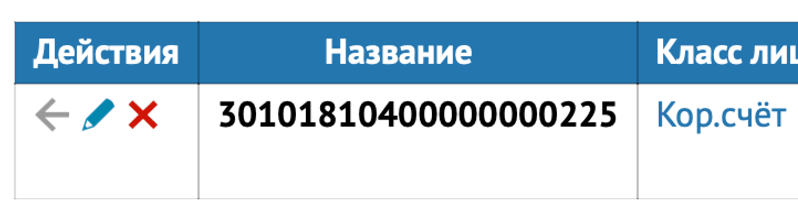

 

Пользователь может совершать различные действия над записями. Например: добавить запись в таблицу, редактировать запись, удалить запись. Кнопки в колонке ***Действия*** могут отличаться в зависимости от логики, которая  реализована для работы с конкретными таблицами.

 

>**Примечание** 
 
Редактирование записи осуществляется двумя способами:
>- Нажатием на кнопку ***Редактировать*** напротив соответствующей записи;
>- Двойным щелчком левой кнопки мыши по соответствующей записи.

 

Кроме того, в системе **АСР Platex®** существуют таблицы, в которых могут  присутствовать дополнительные специфические действия для работы с записями. А также, таблицы, в которых нельзя совершать стандартные действия над записями, такие как: открыть запись на редактирование, удалить запись из таблицы и т.д. Рассмотрим на примере таблицы ***Задания***.

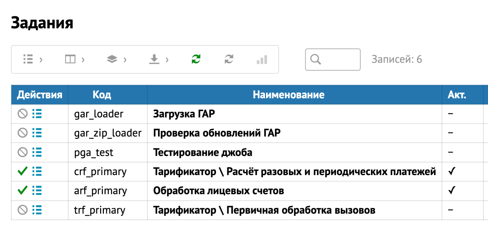

 

Доступными действиями в таблице ***Задания*** являются запуск/остановка периодического задания и просмотр протокола. Описание работы с таблицей  ***Задания*** во вкладке [Задания](СВЯЗАТЬ ССЫЛКОЙ С 3.7.2 Задания )

Ниже приведены описания кнопок, которые могут использоваться для работы с записями таблицы.

 - редактирование записи;

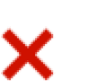 - удаление записи;

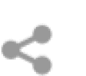 - просмотр/выгрузка/печать информации о договоре/контактах договора;

 - переход к записи в таблице;

 - переход к родительской записи;

 - остановка задания;

 - запуск задания;

 - переход к протоколу;

 - просмотр файлов CDR по выбранному источнику;

 - загрузка и просмотр документа перед печатью;

- открытие родительской таблицы в диалоговом окне и возможность выбора значения из родительской таблицы.

 

### 2.4.2.1 Группировка записей таблицы
 

Для группировки записей таблицы по столбцам необходимо навести курсор на кнопку  и выбрать столбец, по которому нужна группировка.  
В примере произведена группировка по столбцу **Линия А**.

 

### 2.4.3 Работа со столбцами
 

Достаточно часто, возникает необходимость в изменении расположения столбцов в таблице. Это можно сделать таким способом:
нажмите левой кнопкой мыши в шапке таблицы на нужный столбец и, удерживая левую кнопку мыши, перетягивайте столбец в нужное место.

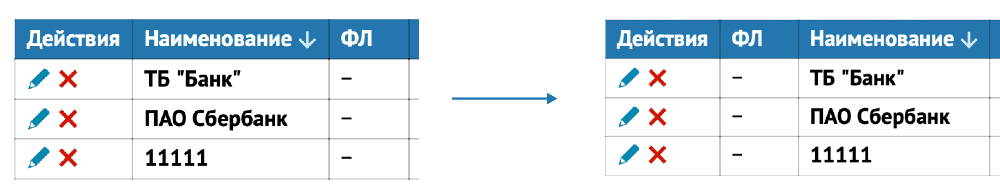

 

Для сортировки таблицы по конкретному столбцу нажмите на название нужного столбца.

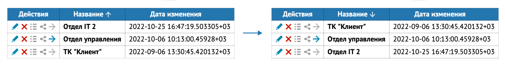

 

### 2.4.3.1 Итоги по столбцам
 
В некоторых таблицах можно произвести расчеты по сумме, среднему значению, минимальному значению и т.д. При нажатии на кнопку   внизу таблицы появляется строка, где можно произвести необходимые расчеты.

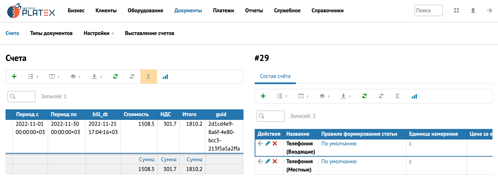

 

### 2.4.4 Диаграммы
 

Кнопка  отображается только в тех таблицах, где можно построить диаграммы. Диаграммы строятся по первому столбцу таблицы (ось X).

В системе 3 вида диаграмм: столбчатая, линейная, круговая. В любой из видов диаграмм, путем вычеркивания ненужных данных, можно выбрать в каких единицах она будет построена (данные каких столбцов не будут отображаться). Приведено на примере столбчатой диаграммы.

**Столбчатая диаграмма:**

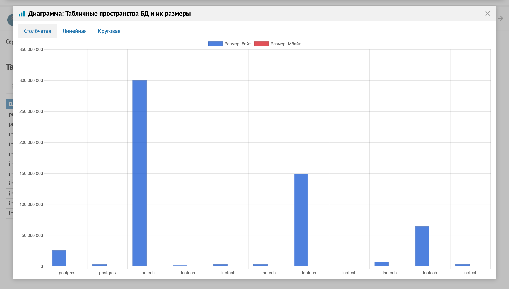

 

 

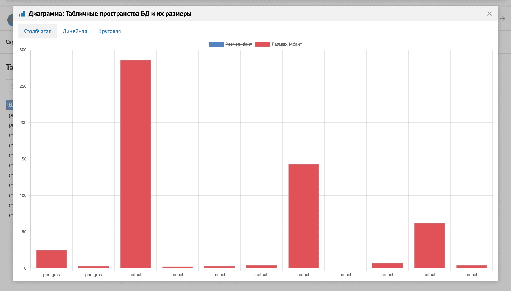

 

**Линейная диаграмма:**

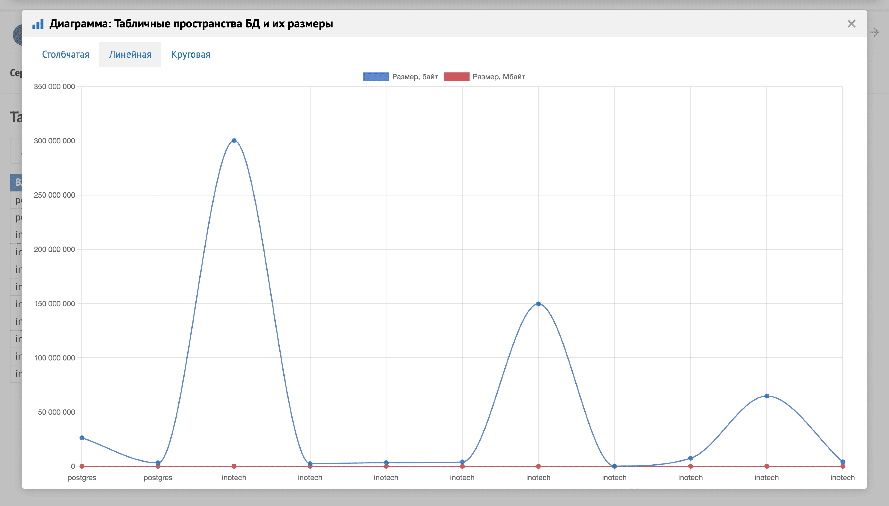

 

**Круговая диаграмма:**

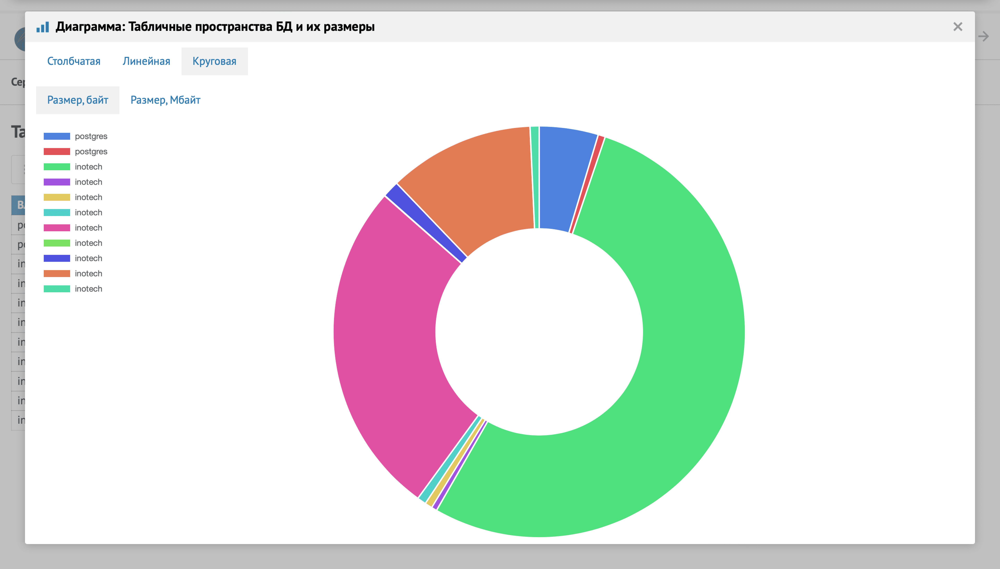

 

## 2.5 Создание записей
### 2.5.1 Создание новой записи
 

Для добавления записи в таблицу нажмите . В диалоговом окне заполните информацию.
При создании большей части таблиц заполняются похожие данные. Рассмотрим на примере создания абонента. Во вкладке ***Основные*** заполняются статус, роль, код, полное наименование, примечание, e-mail, телефон.

 

Напротив ***Статуса*** и ***Роли*** располагается кнопка Кнопка  . Она обозначает переход к родительской таблице. После перехода к родительской таблице введенные данные о созданной записи не сохраняются.

 

При нажатии на кнопку  появляется возможность выбора значения из родительской таблицы, при этом, родительская таблица открывается в диалоговом окне.

 

Во вкладке ***Адреса*** есть возможность заполнить адрес абонента.

 

Адрес заполняется любым из 3 способов: структурированным, произвольным или ФИАС. Во вкладке ***ФИАС*** есть возможность поиска адреса по вводимым в строку данным.

 

Кнопка 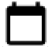 обозначает выбор даты/периода действия из календаря.

 

После заполнения информации об адресе он отобразится во вкладке ***Адреса***. Адрес также можно **Редактировать** и **Удалить**.

 

Во вкладке ***Атрибуты*** заполняются параметры пользователя.
Кнопка  позволяет создать копию строки, в которой кнопка располагается (без переноса данных из копируемой строки). 
Кнопка 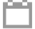 раскрывает дополнительное поле периода действия.

 

Во вкладке ***Классификаторы*** отображаются параметры, по которым можно классифицировать записи той или иной таблицы. Параметры классификатора могут отличаться в зависимости от сущности. Классификатор задается уже после создания сущности (при создании классификаторы не отображаются).

 

При создании записи вкладка ***Протокол*** пустая, так как никаких изменений в еще не созданной записи быть не может.
Рассмотрим вкладку ***Протокол*** на примере уже созданной ранее записи.
В ***Сводке*** отображается информация о дате создания, создателе, дате изменения, редакторе и тд.

 

В ***Истории*** можно посмотреть какой пользователь отредактировал запись, когда произошли изменения и какие значения были изменены.

 

### 2.5.2 Создание учетной записи
 

Создание учетной записи осуществляется во вкладке ***Служебное\Безопасность\Сотрудники (пользователи)***. Если сотрудник не был создан ранее, то необходимо сначала создать сотрудника, а после этого создать учетную запись. 

Для создания учетной записи нажмите  во вкладке ***Учетные записи***.

 

После этого заполните поля во вкладках ***Основные***, ***Логин***.

 

После сохранения у сотрудника (пользователя) появляется информация об его учетной записи, которую можно отредактировать и удалить.

 

Пароль создается после сохранения учетной записи в окне редактирования учетной записи во вкладке ***Пароль***.

